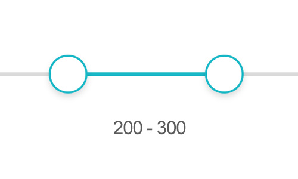

# ranger.jquery.js--拖动选值插件



### 功能场景 ###
1. 两个拖动块,取区间值
2. 支持模块import
3. 支持自定义最大最小值
4. 支持pc和wap
5. 依赖jQuery,对zepto作了兼容处理


### 演示Demo ###
地址：[DEMO](https://denghao.me/demo/2018/ranger/)


### 用法 ###
1. 引入必要文件：ranger.css、jquery(或zepto)、ranger.jquery.js 。
```javascript
    <link rel="stylesheet" href="ranger.css">
    <script src="jquery.js"></script>
    <script src="ranger.jquery.js"></script>
```
2. 调用方法
```javascript
    $("#dom").Ranger({
      from: 200, // 拖块（最小）
      to: 500, // 拖块（最大）
      min: 0, //区间(最小)
      max: 1000, //区间(最大)
      onDrag: function(res) {
        console.log(res) //结果回调
      }
    })
```

### 2018.5.31更新 ###
1. 修复了pc端快速拖动的卡顿问题
2. 优化了内部结构，支持多个实例
